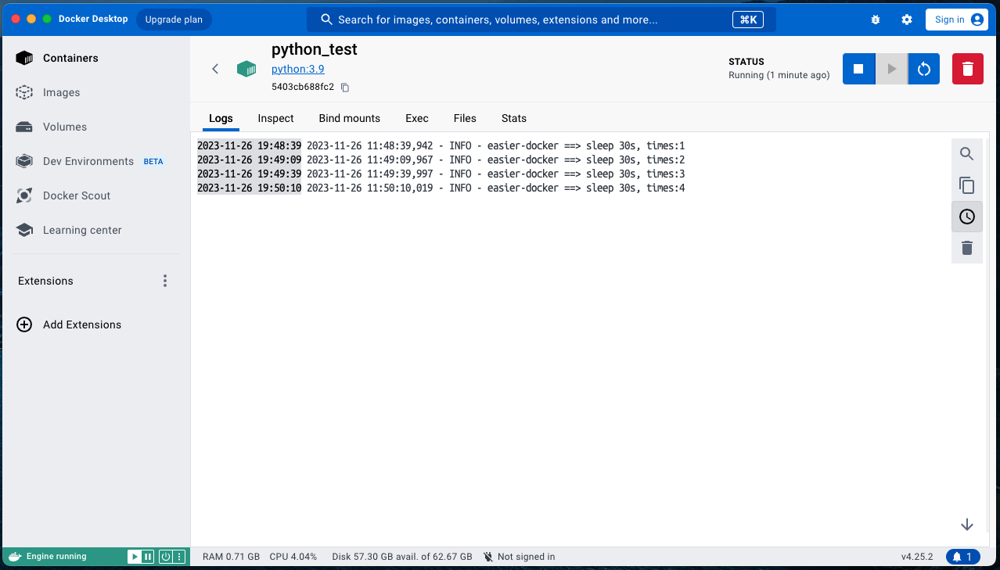

<h1 align="center">easier_docker</h1>
<!---
<p align="center">
  <a href="https://www.python.org/" ></a> 
  <a href="https://www.gnu.org/licenses/gpl-3.0.html" ></a> 
  <a href="https://www.python.org/" ></a> 
  <a href="https://www.selenium.dev/"></a> 
  <a href="https://git-scm.com/"></a> 
  <a href="https://www.jetbrains.com/pycharm/"></a> 
  <a href="https://www.mysql.com/"></a>  
</p>
<p align="center">
    
</p>
--->

## Repository Introduction

A python package that makes it easier for you to use local docker.

💕 If it's helpful to you or cloning it, please star it. This is maximum encouragement for open-source contributors💕

## Install

```shell
pip install easier_docker
```

## Usage

Please check config parameters in [Docker SDK for Python](https://docker-py.readthedocs.io/en/stable/containers.html)

### run example.py

```python
# example.py
import os

from easierdocker import EasierDocker

if __name__ == '__main__':
    host_script = os.path.dirname(os.path.abspath(__file__))
    container_script = '/path/to/container'
    config = {
        'image': 'python:3.9',
        'name': 'python_test',
        'volumes': {
            f'{host_script}': {'bind': container_script, 'mode': 'rw'}
        },
        'detach': True,
        'command': ["sh", "-c", f'cd {container_script} &&'
                                'python docker_example.py'],
    }
    easier_docker = EasierDocker(config)
    easier_docker.start()
    """
    >>> Finding python:3.9 docker image in local
    >>> Finding python_test docker container in local
    >>> ContainerNotFound: python_test
    >>> container id: d9233f82e9a17627d51d294091b43295fdcf3e2fae204f2d8e2bb7080b88c0b0 is running
    """
```
### docker_example.py
```python
# docker_example.py
def main():
    import logging
    import time
    for i in range(1, 101):
        logging.basicConfig(level=logging.INFO, format='%(asctime)s - %(levelname)s - %(message)s')
        logging.info(f'sleep 30s, times:{i}')
        time.sleep(30)


if __name__ == '__main__':
    main()

```

|                                                 |
|-------------------------------------------------|
|          |
|  |

## Related Repository

- [docker-py](https://github.com/docker/docker-py) — A Python library for the Docker Engine API.

## Related materials

- [Docker SDK for Python](https://docker-py.readthedocs.io/en/stable/)


## Maintainers

[@weiensong](https://github.com/weiensong)


## Contributing

How I wish I could add more content in this repo !

Feel free to dive in! [Open an issue](https://github.com/weiensong/easier_docker/issues) or submit PRs.

Standard Python follows the [Python PEP-8](https://peps.python.org/pep-0008/) Code of Conduct.


### Contributors

This project exists thanks to all the people who contribute.  
  
<a href="https://github.com/weiensong/carp/graphs/contributors">
  
</a>


## License

[MIT](https://github.com/weiensong/weiensong/blob/main/.universal/LICENSE) © weiensong

